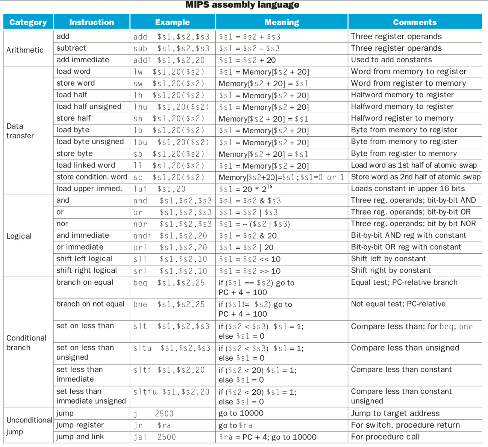

# MIPS_Processor
Using Verilog HDL to simulate a MIPS architecture processor on RTL level...

### MIPS assembly language Supported

(Computer Organization and Design the hardware/software interface FIFTH EDITION P64)

### Version

- [x] V1.0 Single-cycle processor 

- [ ] V2.0 Pipelined processor 

- [ ] V3.0 Pipelined processor with cache 

- [ ] V4.0 Pipelined processor with cache and mmu 
