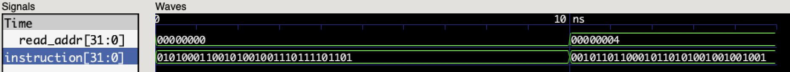
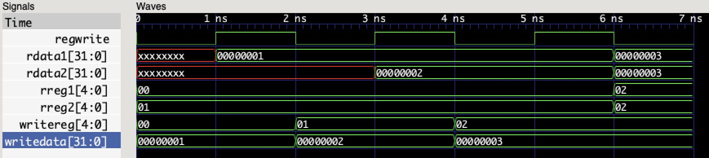
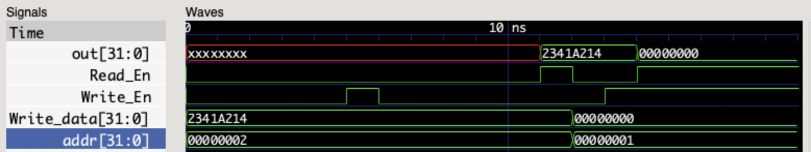
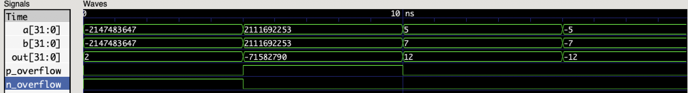
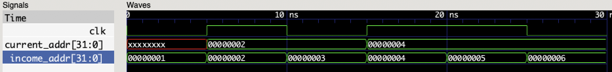

按照实现的时间顺序排列

## Component

### Instruction memory

内部用8bit 的reg存储，每个Byte编一个地址。输出的Instruction为：

rom[read_address] | rom[read_address+1] | rom[read_address+2] | rom[read_address+3] 

### Registers

内部用32bit的reg存储，writereg是写使能，高电平为enable，低电平为disable。

### Data memory 

内部用8bit 的reg存储，每个Byte编一个地址。输出的数据为：

mem[addr] | mem[addr+1] | mem[addr+2] | mem[addr+3]

## Element

### adder

32bit adder，带有溢出检测功能。

实现方法：直接将两个输入数据相加。

溢出检测用**双符号位**方法，首先扩展1bit符号位，然后相加，结果记为result。

result[32:31] == 2'b10：说明负数加成了正数，负溢出（positive overflow）

result[32:31] == 2'b01：说明正数加成了负数，正溢出（negative overflow）

### PC

32bit D触发器，时钟的上升沿（rising-edge）更新数据。

***（仿真的时候感觉有些奇怪...用阻塞赋值先翻转时钟，再更新输入数据，竟然是更新后的新数据通过了D触发器......）***

